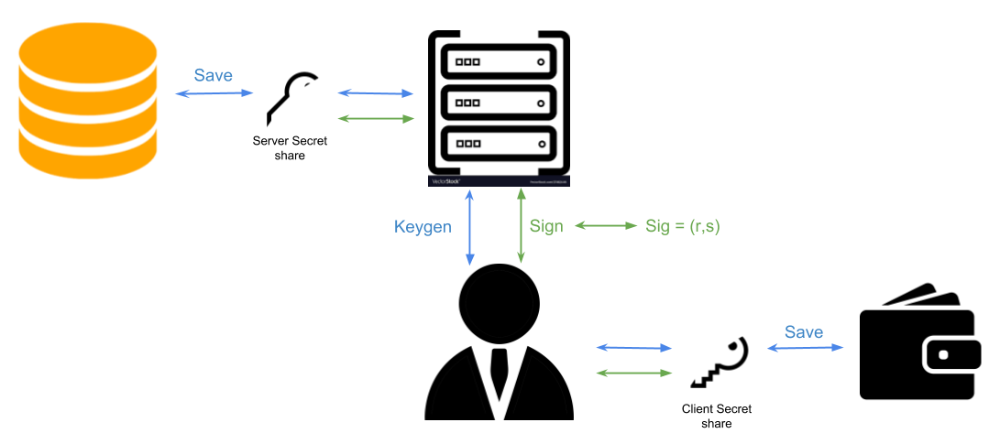

Gotham City
=====================================
Gotham city is a fully functional client/server application for issuing two party ECDSA signatures.

-------
### Server
Gotham **server** is an ECDSA agnostic signing machine.
List of supported Curve(s):

 * secp256k1

### Client
You can see a full fledged example of a client which connects to gotham server under: [integration-tests/test_ecdsa_key_signing](https://github.com/ZenGo-X/gotham-city/blob/master/integration-tests/tests/ecdsa.rs#L109)

[//]: # (List of supported Coin&#40;s&#41;:)

[//]: # ()
[//]: # ( * BTC)

[//]: # ()
[//]: # (**Extending the client to support more coin&#40;s&#41; is easy as long as the Elliptic Curve and signing scheme of the new blockchain are supported. In the case a blockchain is using secp256k1 together with ECDSA, the same keygen and signing code can be reused.**)

[//]: # ()
[//]: # (| ![Demo]&#40;misc/demo.gif&#41; |)

[//]: # (|-----------------------------|)

[//]: # (Elements)

[//]: # (-------)

[//]: # ()
[//]: # (|                                                 | Gotham Server                                | Gotham Client                                |)

[//]: # (| -------------------------------------------- | -------------------------------------------- |--------------------------------------------)

[//]: # (| Description | RESTful web service exposing APIs for two party ECDSA key generation and signing | Bitcoin minimalist decentralized wallet CLI app |)

[//]: # (| Instructions | [View]&#40;gotham-server/README.md&#41; | [View]&#40;gotham-client/README.md&#41; |)

Project Description
-------

### Design Overview

#### ECDSA Keygen and Signing

* For details on Threshold Signatures see [Threshold Signatures: The Future of Private Keys](https://medium.com/kzen-networks/threshold-signatures-private-key-the-next-generation-f27b30793b)

#### Cryptographic libraries
* [secp256k1](https://github.com/rust-bitcoin/rust-secp256k1/): Rust language bindings for Bitcoin secp256k1 library.
* [two-party-ecdsa](https://github.com/KZen-networks/two-party-ecdsa): Rust implelemtation of Lindell's Crypto17 paper: [Fast Secure Two-Party ECDSA Signing](https://eprint.iacr.org/2017/552)

[//]: # (### White paper overview)

[//]: # (#### Abstract)

[//]: # (We demonstrate a Bitcoin wallet that utilizes two party ECDSA &#40;2P-ECDSA&#41;.)

[//]: # (Our architecture relies on a simple client-server communication)

[//]: # (model. We show support for 2 party deterministic child derivation)

[//]: # (&#40;2P-HD&#41;, secret share rotation and verifiable recovery. We discuss the)

[//]: # (opportunities and challenges of using a multi-party wallet.)

[//]: # ()
[//]: # (#### Background)

[//]: # (For end-users, cryptocurrencies and blockchain-based assets are hard to store and manage.)

[//]: # (One of the reasons is the tradeoff between security and availability.)

[//]: # (Storing private keys safely requires dedicated hardware or extreme security measures which make using the coins)

[//]: # (on a daily basis difficult. Threshold cryptography provides ways to distribute the private key and digital signing.)

[//]: # (This can potentially benefit security but at the same time reveal new challenges such as availability, ownership and recovery.)

[//]: # (Bitcoin is utilizing ECDSA as the signing scheme. There is an active line of research for practical and efficient multi-party ECDSA schemes.)

**For more information, see our [white paper](white-paper/white-paper.pdf)**.

[//]: # (### Comperative Performance)

[//]: # (The comparison was done on an Intel i9-8950HK &#40;2.9GHz&#41; using localhost for server &#40;no real network&#41;. The numbers are mean for 20 runs of 2P-ECDSA KeyGen and 50 runs for 2P-ECDSA Signing. Standard deviation is inconsistent but for both implementations it is order of magnitude smaller than mean value.)

[//]: # ()
[//]: # (|        Implementation         |   Gotham city &#40;this repo&#41;    |    [Unbound]&#40;https://github.com/unbound-tech/blockchain-crypto-mpc&#41;       | )

[//]: # (|-------------------------------|------------------------|------------------------|)

[//]: # (| 2P-ECDSA KeyGen                      |        1.05 s            |      **0.813** s           |)

[//]: # (|    2P-ECDSA Signing    |      **0.153** s        |      0.206 s     |)

Disclaimer
-------
### **USE AT YOUR OWN RISK, we are not responsible for software/hardware and/or any transactional issues that may occur while using Gotham city.The project is currently work in progress.**

License
-------
See [LICENSE](LICENSE) for more information.

Contact
-------
For any questions, feel free to [email us](mailto:github@kzencorp.com) or join ZenGo X [Telegram](https://t.me/joinchat/ET1mddGXRoyCxZ-7).
