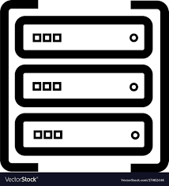

# Gotham Server


## Introduction
Gotham server is a RESTful web service exposing APIs for two party ECDSA key generation and signing.

## Installation
### Launching the server
```bash
git clone https://github.com/KZen-networks/gotham-city.git
cd gotham-city/gotham-server
cargo run --release
```

* By default, the server will use a local [RocksDB](https://rocksdb.org/).<br> 
Optionally, it can use a remote [AWS DynamoDB](https://aws.amazon.com/dynamodb/), 
by setting the environment variable `DB` to the value `AWS`, and the AWS credentials `AWS_ACCESS_KEY_ID` and `AWS_SECRET_ACCESS_KEY`. 

* By default, the server will use no authentication (PASSTHROUGH).<br> 
Optionally, it can use JWT with AWS Cognito as a service provider by setting proper environment variable (audience, region, pool_id, issuer).

### Running tests
#### Without timing output
```bash
RUST_TEST_THREADS=1 cargo test --release
```

#### With timing output
```bash
RUST_TEST_THREADS=1  cargo test --release -- --nocapture
```
